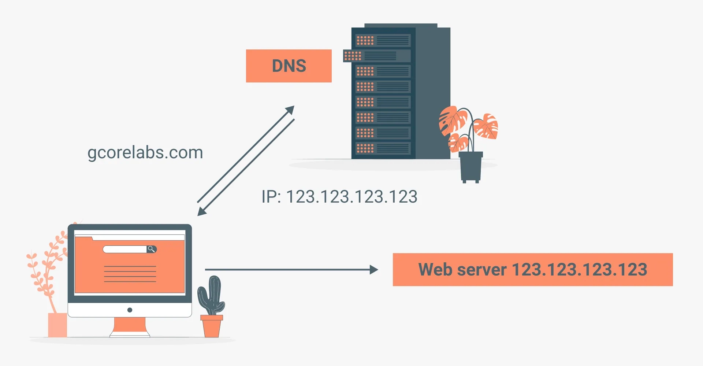
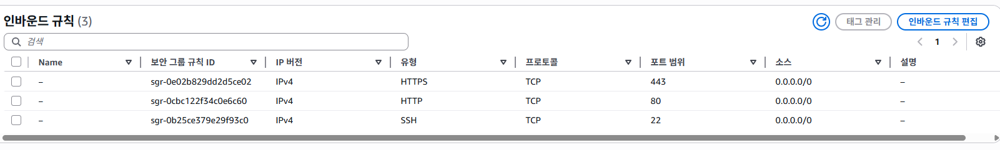
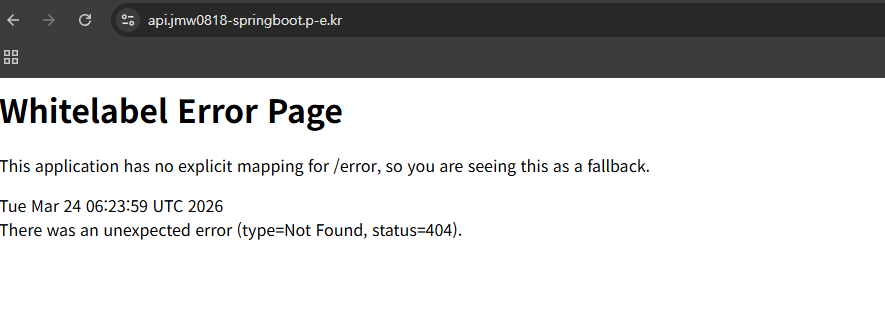

# 📂 03.24 수업 내용  
# 📍 안내사항

# 🟩 도메인(Domain)
naver.com / youtube.com과 같이 **문자로 만들어진 컴퓨터 주소**를 의미한다. IP도 컴퓨터 주소였지만 숫자로 이루어진 것이고, 도메인은 문자열을 만든 다음에 IP주소와 매핑을 시켰다고 볼 수 있다.

## 🟢 서브 도메인(Sub Domain)
naver 기준으로 확인해본다면, naver.com 도 있고 map.naver.com / search.naver.com 과 같은 주소를 확인할 수 있다. 즉, `_.naver.com` 형태의 도메인을 서브 도메인이라고 한다. 그리고 그 정의는 **하나의 도메인 _아래_ 에서 여러 서비스를 구분하여 관리** 할 때 사용한다. 서브 도메인들은 각각 따로 구매하는 것이 아니라 naver.com 하나 구매하면 모든 서브 도메인이 이용 가능하다.

- 실무 에서의 서브 도메인 활용 방안
    - 서브 도메인은 메인 웹 사이트, 관리자 웹 사이트, 백엔드 서버 등의 구성 요소를 구분하기 위해 활용하는 편이다. 예를들어 maybeags.kr이라고 하는 도메인을 구매했다고 가정했을 때, 메인 웹 서버의 도메인으로는 api.maybeags.kr이 되는 방식이겠다.

### 웹 서비스에 도메인을 적용하는 이유
일반적으로 백엔드의 api와 통신하는 경우가 많은데, 보안상 실무에서 서비스 운영할 때는 도메인 적용이 사실상 필수적이다. 기억하기 쉽고, IP 주소로는 HTTPS를 적용할 수 없다.

### DNS(Domain Name System)
**도메인 주소를 IP 주소로 변환하는 시스템**


1. DNS 레코드
    - https://내도메인.한국 에서 도메인 발급


## 🟢 ELB 이해하기

### HTTP vs HTTPS
대부분의 웹 사이트는 HyperText Transfer Protocol이라는 방식으로 서버와 데이터를 주고 받는다. HTTP는 주고 받는 데이터를 암호화하지 않기 때문에 중간에 데이터를 가로채는것이 가능하다.

### HTTPS 적용 이유
1. 보안강화 : HTTPS 적용을 하면 데이터를 암호화해서 통신하기 때문에 추가 작업이 필요하다. 백엔드 서버의 주소도 HTTPS 인증을 받아야겠다. 따라서 데이터를 안전하게 주고받을 수 있도록 FE-BE서버 모두 HTTPS를 적용한다.
2. SEO(Search Engine Optimization) : 구글이나 네이버 같은 검색 엔진에서 HTTPS 적용하면 상위 노출 점수를 좀 더 준다.
3. 사용자 이탈 방지 : https 적용이 안되어있으면 크롬에서 warn을 띄운다.

### ELB(Elastic Load Balancing)
AWS에서 제공하는 로드 밸런서 서비스를 의미한다. 로드 밸런서는 트래픽을 여러 서버에 걸쳐 분산하는 장치로, 특정 서버에 트래픽이 집중되는 것을 방지하고, 장애가 발생하더라도 정상적인 서버로 트래픽을 전달할 수 있도록 한다. 즉, 같은 역할을 하는 서버를 2대 이상 복수로 운영하는 경우 안정된 서비스를 제공하기 위해 ELB를 도입한다.

또한 ELB에서는 특정 포트에서 HTTPS 요청을 처리하도록 설정할 수 있음으로 보안이 필요한 웹사이트나 API 서버에서도 많이 사용하게 된다.

### ELB의 구성 요소
1. 리스너(listener) : ELB로 들어오는 요청을 어떻게 처리할지 결정하는 규칙. 특정 포트와 프로토콜을 이용하여 클라이언트의 요청을 기다리고, 해당 요청을 ELB에서 설정된 규칙에 따라 적절한 _대상 그룹_ 으로 전달해준다. 예를 들어서 HTTPS 프로토콜을 사용하는 리스너는 443 포트에서 보안 연결을 통해 들어오는 트래픽을 받아서 암호화된 상태로 처리해준다. 리스너를 잘못 설정하면 요청을 올바른 대상 그룹으로 전달하지 못함으로 리스너 설정에 주의를 해야 한다.

2. 대상 그룹(target group) : ELB가 수신한 트래픽을 전달할 서버들의 집합을 의미한다. 즉 ELB로 들어온 요청을 어디로 보낼지 경정해야 하는데, 그 어떤 곳들을 대상 그룹이라고 볼 수 있다. ELB에 EC2 인스턴스를 추가한다면 ELB는 들어온 요청을 EC2 인스턴스로 전달해주게 된다. 그런데 EC2에 오류가 발생해서 서버가 멈췄다고 가정한다면, 보내봤자 쓸모 없을 것이기 때문에 ELB는 대상 그룹 내에 있는 EC2 인스턴트들이 살아있는지 확인하기 위해 주기적으로 요청을 보내본다. 그때 200K가 리턴되면 살아있다고 보고 요청을 해당 인스턴스에 보내게 되고, 리턴되지 않는다면 그 인스턴스에는 요청을 보내지 않는 **상태검사(health check)**도 수행해주는 기능이 있다. 대상 그룹을 만들 때 상태 검사를 할 경로와 포트를 지정해준다.




`sudo apt install -y nginx`

`sudo tee /etc/nginx/sites-available/springboot` : Sptringboot 프로젝트를 Nginx 설정 파일을 생성하는 명령어
-> 엔터를 치면 아무런 메시지가 없고 커서가 깜빡거린다. 이제 이 이후에 쓰는 내용의 입력을 기다리는 입력 상태가 된다.

`sudo nano /etc/nginx/sites-available/springboot`
-> nano : 텍스트 편집기
```
server {
  listen 80;
  server_name api.jmw0818-springboot.p-e.kr;

  location / {
    proxy_pass http://localhost:8080;
    proxy_set_header Host $host;
    proxy_set_header X-Real-IP $remote_addr;
    proxy_set_header X-Forwarded-For $proxy_add_x_forwarded_for;
    proxy_set_header X-Forwarded-Proto $scheme;
  }
}
```

```bash
sudo ln -s /etc/nginx/sites-available/springboot /etc/nginx/sites-enabled/
sudo rm -f /etc/nginx/sites-enabled/default
sudo nginx -t && sudo systemctl restart nginx
```
1. sites-available에 있는 springboot 파일을 sites-enabled로 심볼릭 링크(바로가기)를 만들어준다.
    - 이유 : Nginx가 sites-available에 있는 것을 실행 못시키고 enabled에 있는 파일만 읽어서 서버를 돌리기 때문이다.(보안문제) 원본은 sites-available이라는 보관소에 두고, 필요할 때만 바로가기를 통해 해당 설정을 사용하겠다는 의미다.

2. /etc/nginx/sites-enabled 경로에 default라는 파일이 있다. Nginx 기본 설정이라고 볼 수 있는데, 삭제해서 springboot 설정을 사용하겠다는 뜻이다.

3. sudo nginx -t : 오타나 문법 상 오류가 없는지 테스트한다.
    - sudo systemctl restart nginx : ngix 리스타트

## 🟢 NginX
Apache와 같은 웹서버이자 클라이언트 요청을 백엔드로 연결시켜주는 리버스 프록시 서버에 해당한다. 손님(사용자)과 주방(Spring 프로젝트) 사이에서 주문을 효율적으로 관리하고 음식을 서빙하는 역할이다.

### 사용 이유
1. 리버스 프록시 : 보안을 위해 사용자가 실제 애플리케이션 서버(현재 기준으로 8080)에 직접 접근하지 못하게 막고, 자기가 받아가지고 토스해주는 역할을 한다.
2. 로드밸런싱 : ELB라는 것은 AWS에서의 서비스 명이고 load balancing 개념 자체는 다른 곳에서도 쓰인다. 접속자가 너무 많을 때 여러 대의 서버로 요청을 분산시켜서 서버 다운을 방지하고, 서버가 다운이 되면 다른 곳으로 보내주는 등의 역할을 한다.
3. 정적 파일 처리 : 기본적으로 static 폴더 내에 있는 HTML / CSS / 이미지 등에 있는 변하지 않는 정적 파일들을 애플리케이션 서버를 거치지 않고 직접 응답시켜줘서 효율을 높일 때 사용한다. (resources/static -> 하지만 react에서는 무관)
4. SSL(HTTPS) 설정 : 보안 인증서 적용 작업을 nginx 내에서 처리할 수 있다.

### 기존 서버 (Spring(Boot)의 Apache)와의 차이점
- nginx는 비동기 이벤트 기반 방식을 사용하여 효율성을 높이고 이상에서의 특징들을 적용할 수 있기 때문에 최근에는 채용한다. 다만 초반 설정 때문에 SpringBoot의 기본 Web server는 여전히 Apache이다.

### HTTPS 적용
Certbot 설치 + HTTPS 발급 

```bash
sudo snap install --classic certbot
sudo ln -s /snap/bin/certbot /usr/bin/certbot
sudo certbot --nginx -d api.jmw0818-springboot.p-e.kr
```
1. certbot 프로그램 설치 : 무료 SSL 인증서를 발급해주고 nginx 설정을 _자동 수정_ 해서 HTTPS를 적용시켜준다. --classic은 시스템 접근 권한을 준다는 뜻이다.

2. 실행 파일을 /usr/bin/으로 바로가기를 만듬 : 터미널 어느 링크든지간에 상관없이 명령어를 실행시킬 수 있도록

3. sudo 권한으로 certbot을 실행시키는데, `--nginx`를 통해서 nginx 설정 파일을 **알아서 HTTPS로 수정해라**는 의미. `-d 도메인주소`는 인증서 받을 도메인 주소를 지정한다.

- 실행 후 질문사항
    1. 이메일 입력
    2. Terms of Service : 약관 동의
    3. 광고 볼거니 : Y했음..


# 🚨발생한 문제


# 📖 복습 & 확인
✔️ 내용
💡📌📍🚩🚨⚠️